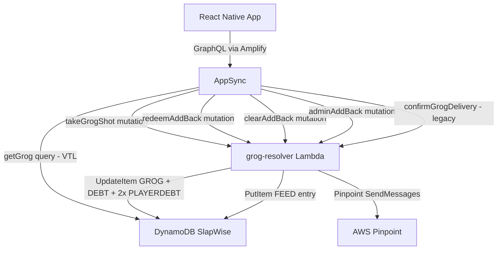

# Design Document: Grog Shot Delivery Flow

## Overview

This feature redesigns the Infinity Grog shot delivery workflow. The existing `confirmGrogDelivery` mutation is a single atomic action that takes the shot and optionally adds back a liquor in one step. Real-world usage requires more flexibility: the debtor may see the Sentence Screen but not be near the bottle, and the add-back decision may need to happen later.

The redesign introduces:
- A **"Take Later"** button on the Sentence Screen so the debtor can dismiss without committing.
- A new **`takeGrogShot`** mutation that records the shot, applies proportional removal, marks the debt delivered, and creates a `PendingAddBack` record — all atomically.
- A **`pendingAddBacks`** list stored on the GROG DynamoDB item, co-located with grog state.
- Three new mutations — **`redeemAddBack`**, **`clearAddBack`**, **`adminAddBack`** — for acting on pending add-backs.
- My Slate updates to surface "Take Your Shot" and "Add Back to Grog" cards.
- A **Manage Mode** on the Grog Review Screen that gates all admin controls behind a toggle, keeping the default view clean for all players.

`confirmGrogDelivery` is retained in the schema for backwards compatibility but is not called by any new flow.

## Architecture



**Key decisions:**

- All four new mutations route to the existing `grog-resolver` Lambda. The dispatcher already switches on `event.info.fieldName`, so adding new cases requires no infrastructure changes beyond new AppSync resolver attachments.
- `pendingAddBacks` is stored as a list of maps on the GROG item (`PK = GROG#<groupId>`, `SK = METADATA`). This keeps all grog state in one item and avoids a separate GSI or item type.
- `takeGrogShot` performs a multi-item write: it updates the GROG item (proportional removal + pendingAddBacks append) and the DEBT item (status → delivered) and both PLAYERDEBT items in a single `TransactWrite`. This is the only mutation that touches items outside the GROG item.
- `redeemAddBack`, `clearAddBack`, and `adminAddBack` only touch the GROG item — single `UpdateItem`.

## Components and Interfaces

### Infrastructure

**`grog-resolver` Lambda** (`infrastructure/lambda/grog-resolver/index.ts`)

Extended dispatcher table:

| fieldName | DynamoDB operation |
|---|---|
| `takeGrogShot` | `TransactWrite`: UpdateItem GROG (proportional removal + pendingAddBacks append + history) + UpdateItem DEBT (status→delivered, deliveredAt) + UpdateItem 2× PLAYERDEBT (status→delivered) + PutItem FEED entry |
| `redeemAddBack` | `UpdateItem` GROG: add liquor (merge logic) + remove pendingAddBacks entry + append addition history event |
| `clearAddBack` | `UpdateItem` GROG: remove pendingAddBacks entry only |
| `adminAddBack` | `UpdateItem` GROG: add liquor (merge logic) + remove pendingAddBacks entry + append addition history event |
| `confirmGrogDelivery` | Unchanged — legacy path |

Authorization rules:
- `takeGrogShot`: caller must be the debtor on the referenced debt (fetched from DEBT item).
- `redeemAddBack`: caller must be the debtor for that `debtId` (from pendingAddBacks entry) or an admin.
- `clearAddBack`: caller must be an admin.
- `adminAddBack`: caller must be an admin.

**AppSync resolvers added:**
- `Mutation.takeGrogShot` → grog-resolver Lambda
- `Mutation.redeemAddBack` → grog-resolver Lambda
- `Mutation.clearAddBack` → grog-resolver Lambda
- `Mutation.adminAddBack` → grog-resolver Lambda

### Pure Logic (`infrastructure/lambda/grog-resolver/logic.ts`)

New exported functions added alongside existing ones:

```typescript
export interface PendingAddBack {
  debtId: string;
  debtorId: string;
  createdAt: string;
}

/**
 * Applies proportional removal + appends shot_taken event + appends pendingAddBack.
 * Returns [newEntries, newHistory, newPendingAddBacks].
 */
export function applyTakeGrogShot(
  entries: GrogEntry[],
  history: GrogHistoryEvent[],
  pendingAddBacks: PendingAddBack[],
  debtorId: string,
  debtId: string,
  now: string,
  shotEventId: string,
): [GrogEntry[], GrogHistoryEvent[], PendingAddBack[]];

/**
 * Applies add-back merge logic + removes matching pendingAddBacks entry + appends addition event.
 * Returns null if debtId not found in pendingAddBacks.
 */
export function applyRedeemAddBack(
  entries: GrogEntry[],
  history: GrogHistoryEvent[],
  pendingAddBacks: PendingAddBack[],
  debtId: string,
  input: AddLiquorInput,
  actorPlayerId: string,
  now: string,
  newEntryId: string,
  eventId: string,
): [GrogEntry[], GrogHistoryEvent[], PendingAddBack[]] | null;

/**
 * Removes matching pendingAddBacks entry without touching entries or history.
 * Returns null if debtId not found.
 */
export function applyClearAddBack(
  pendingAddBacks: PendingAddBack[],
  debtId: string,
): PendingAddBack[] | null;
```

`adminAddBack` reuses `applyRedeemAddBack` — the logic is identical; only the authorization check differs.

### App Services

**`GrogService`** (`app/src/services/GrogService.ts`)

New methods added:

```typescript
export const GrogService = {
  // ... existing methods unchanged ...
  takeGrogShot(groupId: string, debtId: string): Promise<Grog>,
  redeemAddBack(groupId: string, debtId: string, category: LiquorCategory, brand: string): Promise<Grog>,
  clearAddBack(groupId: string, debtId: string): Promise<Grog>,
  adminAddBack(groupId: string, debtId: string, category: LiquorCategory, brand: string): Promise<Grog>,
}
```

The `GROG_FIELDS` fragment is extended to include `pendingAddBacks { debtId debtorId createdAt }`.

### App Screens

**`InfinityGrogSentenceScreen`** (`app/src/screens/InfinityGrogSentenceScreen.tsx`)

Changes from current implementation:

- Add **"Take Later"** button below the skull visualization. Tapping calls `navigation.goBack()` with no mutation.
- Replace `handleTakeTheShot` → `handleAddLiquorSubmit` → `confirmDelivery` flow with a new two-phase flow:
  1. Tap "Take the Shot" → call `GrogService.takeGrogShot(groupId, debtId)`.
  2. On success → show post-shot dialog (modal overlay, not a bottom sheet).
  3. Dialog option "Add Back Now" → show `AddLiquorSheet` → on submit call `GrogService.redeemAddBack(...)` → navigate back.
  4. Dialog option "Add Back Later" → navigate back immediately (PendingAddBack already created by `takeGrogShot`).
- Error handling: if `takeGrogShot` fails, show inline error and allow retry. Do not navigate away.
- New local state: `shotTaken: boolean`, `showPostShotDialog: boolean`.

```
State machine:
  idle
    → [tap "Take the Shot"] → taking (spinner on button)
      → [success] → shotTaken=true, showPostShotDialog=true
      → [error] → idle (inline error)
  showPostShotDialog=true
    → [tap "Add Back Now"] → showAddLiquor=true, showPostShotDialog=false
      → [submit AddLiquorSheet] → redeeming → navigate back
      → [close AddLiquorSheet without submit] → navigate back (add-back deferred)
    → [tap "Add Back Later"] → navigate back
```

**`MySlateScreen`** (`app/src/screens/MySlateScreen.tsx`)

Changes:

- The screen now fetches grog data in addition to debts and members: `GrogService.getGrog(groupId)` added to the `Promise.all` on mount.
- **"Take Your Shot" card**: debts with `status = 'resolved'` and `debtPunishment = 'infinity_grog'` where `debtorId === currentPlayerId` navigate to `InfinityGrogSentence` (already partially implemented; this formalizes it).
- **"Add Back to Grog" card**: for each entry in `grog.pendingAddBacks` where `debtorId === currentPlayerId`, render a separate card in "Outstanding Punishments". Tapping opens an inline `AddLiquorSheet` and calls `GrogService.redeemAddBack(...)` on submit.
- My Slate only shows the current player's own pending add-backs. Admin controls for other players' add-backs live on the Review Screen.

**`InfinityGrogReviewScreen`** (`app/src/screens/InfinityGrogReviewScreen.tsx`)

Changes:

- Add `manageMode: boolean` state, default `false`.
- Admin players see a **"Manage"** button in the navigation header (set via `navigation.setOptions`). Tapping toggles `manageMode`. When active, the header title changes to "Managing Grog" and the button label changes to "Done".
- **Default view** (manageMode = false): skull visualization + history log only. No admin controls visible regardless of admin status.
- **Manage Mode** (manageMode = true, admin only):
  - Contents drawer shows per-entry Remove and volume adjustment controls.
  - "Add Liquor" button appears in the drawer.
  - "Initialize Grog" button shown when no grog exists.
  - **Pending Add-Backs section** rendered below the skull (above history) when `grog.pendingAddBacks.length > 0`. Each row shows debtor username + date, with "Add Shot" (opens `AddLiquorSheet`, calls `adminAddBack`) and "Clear" (calls `clearAddBack`) actions.
- Non-admin players never see the "Manage" button and `manageMode` is always false.

### Navigation

No new screens are added. The existing `InfinityGrogSentence` and `InfinityGrogReview` routes are reused. `RootStackParamList` is unchanged.

## Data Models

### DynamoDB Item: GROG (updated)

| Attribute | Type | Notes |
|---|---|---|
| PK | String | `GROG#<groupId>` |
| SK | String | `METADATA` |
| groupId | String | UUID |
| bottleSize | Number | mL, float |
| entries | List | `GrogEntry[]` |
| history | List | `GrogHistoryEvent[]` |
| pendingAddBacks | List | `PendingAddBack[]` — new attribute |
| createdAt | String | ISO8601 |
| createdBy | String | playerId |

### PendingAddBack (Map inside pendingAddBacks list)

| Attribute | Type | Notes |
|---|---|---|
| debtId | String | UUID of the triggering debt |
| debtorId | String | playerId of the debtor who took the shot |
| createdAt | String | ISO8601 timestamp of when the shot was taken |

### GrogHistoryEvent — no changes

`takeGrogShot` produces a `shot_taken` event (already in the union). `redeemAddBack` and `adminAddBack` produce `addition` events (already in the union). No new event types needed.

### TypeScript Types (`app/src/types/index.ts`)

```typescript
export interface PendingAddBack {
  debtId: string;
  debtorId: string;
  createdAt: string;
}

// Updated Grog interface:
export interface Grog {
  groupId: string;
  bottleSize: number;
  entries: GrogEntry[];
  history: GrogHistoryEvent[];
  pendingAddBacks: PendingAddBack[];  // new field
}
```

`GrogHistoryEventType` is unchanged — `'addition' | 'shot_taken'` covers all new events.

### GraphQL Schema Extensions

```graphql
type PendingAddBack {
  debtId: ID!
  debtorId: ID!
  createdAt: AWSDateTime!
}

# Updated Grog type:
type Grog {
  groupId: ID!
  bottleSize: Float!
  entries: [GrogEntry!]!
  history: [GrogHistoryEvent!]!
  pendingAddBacks: [PendingAddBack!]!   # new field
}

# New mutations:
takeGrogShot(groupId: ID!, debtId: ID!): Grog!
redeemAddBack(groupId: ID!, debtId: ID!, category: LiquorCategory!, brand: String!): Grog!
clearAddBack(groupId: ID!, debtId: ID!): Grog!
adminAddBack(groupId: ID!, debtId: ID!, category: LiquorCategory!, brand: String!): Grog!

# Retained for backwards compatibility — not called by new flows:
confirmGrogDelivery(groupId: ID!, debtId: ID!, addBack: AddLiquorInput): Grog!
```

### takeGrogShot — Multi-Item Write

`takeGrogShot` is the only new mutation that writes outside the GROG item. It uses a `TransactWrite` with four operations:

1. **UpdateItem GROG** — apply proportional removal to `entries`, append `shot_taken` to `history`, append entry to `pendingAddBacks`.
2. **UpdateItem DEBT** — set `status = 'delivered'`, `deliveredAt = now`.
3. **UpdateItem PLAYERDEBT (debtor)** — set `status = 'delivered'`.
4. **UpdateItem PLAYERDEBT (creditor)** — set `status = 'delivered'`.

After the `TransactWrite` succeeds, the Lambda writes the FEED entry (separate `PutItem`) and sends the push notification via Pinpoint. These are best-effort — a failure here does not roll back the shot.

The DEBT item must be fetched before the `TransactWrite` to:
- Verify `status === 'resolved'` and `debtPunishment === 'infinity_grog'`.
- Verify `callerId === debtorId`.
- Obtain `creditorId` for the second PLAYERDEBT key.

PLAYERDEBT keys are constructed as:
- `PK = PLAYERDEBT#<playerId>#GROUP#<groupId>`, `SK = DEBT#<createdAt>#<debtId>`

`createdAt` must be read from the DEBT item to reconstruct the SK.

### Proportional Removal — unchanged

`applyProportionalRemoval` from `logic.ts` is reused directly inside `applyTakeGrogShot`. No changes to the algorithm.

### Add-Back Merge Logic — unchanged

`applyAddLiquor` from `logic.ts` is reused directly inside `applyRedeemAddBack`. Same merge behavior: if an entry with matching `brand + category` exists, increment `amountMl` by `SHOT_ML`; otherwise create a new entry with `amountMl = SHOT_ML`.

## Correctness Properties

*A property is a characteristic or behavior that should hold true across all valid executions of a system — essentially, a formal statement about what the system should do. Properties serve as the bridge between human-readable specifications and machine-verifiable correctness guarantees.*

### Property 1: takeGrogShot applies proportional removal and appends shot_taken event

*For any* non-empty grog state (entries, history, pendingAddBacks), calling `applyTakeGrogShot` should reduce each entry's `amountMl` by `SHOT_ML * (entry.amountMl / totalAmountMl)`, remove entries that drop to ≤ 0.01 mL, and append exactly one `shot_taken` GrogHistoryEvent with `amountMl = SHOT_ML` and `sourceDebtId = debtId`.

**Validates: Requirements 2.1, 2.2**

### Property 2: takeGrogShot appends exactly one PendingAddBack with correct fields

*For any* grog state, calling `applyTakeGrogShot` with a given `debtorId` and `debtId` should result in `pendingAddBacks.length` increasing by exactly 1, and the new entry should have `debtId` and `debtorId` matching the arguments.

**Validates: Requirements 2.5, 4.2, 4.3**

### Property 3: redeemAddBack applies merge logic, appends addition event, removes pending entry

*For any* grog state where `pendingAddBacks` contains an entry for `debtId`, calling `applyRedeemAddBack` should: (a) apply the same merge logic as `applyAddLiquor` to `entries`, (b) append exactly one `addition` GrogHistoryEvent with `sourceDebtId = debtId`, and (c) remove the matching entry from `pendingAddBacks` so that `pendingAddBacks.length` decreases by exactly 1.

**Validates: Requirements 5.1, 5.2, 5.3, 4.4**

### Property 4: clearAddBack removes pending entry without touching entries or history

*For any* grog state where `pendingAddBacks` contains an entry for `debtId`, calling `applyClearAddBack` should remove exactly that entry from `pendingAddBacks` while leaving `entries` and `history` completely unchanged.

**Validates: Requirements 6.1, 4.5**

### Property 5: redeemAddBack and clearAddBack return not-found for unknown debtId

*For any* grog state and any `debtId` that does not appear in `pendingAddBacks`, both `applyRedeemAddBack` and `applyClearAddBack` should return `null` (signaling a not-found error) and leave all state unchanged.

**Validates: Requirements 5.5, 6.3**

### Property 6: My Slate outstanding section contains exactly the right grog obligations

*For any* list of `PlayerDebtIndex` items and a `PendingAddBack` list, the outstanding punishments section for a given `currentPlayerId` should contain: (a) exactly those debts with `status = 'resolved'` and `debtPunishment = 'infinity_grog'` and `debtorId = currentPlayerId` as "Take Your Shot" cards, and (b) exactly those `pendingAddBacks` entries with `debtorId = currentPlayerId` as "Add Back to Grog" cards — no more, no less.

**Validates: Requirements 1.3, 3.5, 7.1, 7.3, 7.5**

### Property 7: PendingAddBack data completeness

*For any* `PendingAddBack` object produced by `applyTakeGrogShot`, all three required fields (`debtId`, `debtorId`, `createdAt`) must be present, non-null, and non-empty strings.

**Validates: Requirements 4.2, 9.1**

### Property 8: adminAddBack is equivalent to redeemAddBack for grog state transitions

*For any* grog state with a matching `pendingAddBacks` entry, `adminAddBack` should produce the same `entries`, `history`, and `pendingAddBacks` result as `redeemAddBack` called with the same arguments — the only difference is the authorization check, not the state transition.

**Validates: Requirements 4.6**

## Error Handling

### Lambda (`grog-resolver`) — new error conditions

| Error condition | Response |
|---|---|
| `takeGrogShot` by non-debtor | `UNAUTHORIZED` — state unchanged |
| `takeGrogShot` on debt with `status != 'resolved'` | `INVALID_DEBT_STATUS` |
| `takeGrogShot` on debt with `debtPunishment != 'infinity_grog'` | `INVALID_DEBT_PUNISHMENT` |
| `takeGrogShot` on debt not found | `DEBT_NOT_FOUND` |
| `redeemAddBack` by non-debtor non-admin | `UNAUTHORIZED` |
| `redeemAddBack` with unknown `debtId` in pendingAddBacks | `PENDING_ADD_BACK_NOT_FOUND` |
| `clearAddBack` by non-admin | `UNAUTHORIZED` |
| `clearAddBack` with unknown `debtId` | `PENDING_ADD_BACK_NOT_FOUND` |
| `adminAddBack` by non-admin | `UNAUTHORIZED` |
| `adminAddBack` with unknown `debtId` | `PENDING_ADD_BACK_NOT_FOUND` |
| `TransactWrite` condition failure (concurrent modification) | DynamoDB `TransactionCanceledException` caught → `CONFLICT` |
| FEED write failure after successful `TransactWrite` | Logged, not re-thrown — shot is already recorded |
| Pinpoint failure after successful `TransactWrite` | Logged, not re-thrown — shot is already recorded |

All errors are logged with `console.error('[grog-resolver] fieldName:', err)` before being re-thrown or returned.

### App (`GrogService` / screens)

- `takeGrogShot` failure: inline error on Sentence Screen, button re-enabled for retry. Do not navigate away.
- `redeemAddBack` failure (from My Slate or post-shot dialog): inline error, form stays open for retry.
- `clearAddBack` / `adminAddBack` failure (from Review Screen manage mode): inline error per row.
- All errors logged with `console.error('[ScreenName] context:', err)`.

## Testing Strategy

### Dual Testing Approach

Unit tests cover specific examples and edge cases. Property-based tests verify universal correctness across randomized inputs. Both are required.

### Property-Based Testing

Library: **fast-check** (already in the project). Tests live in `app/src/tests/`. Run with `vitest --run`.

Each property test runs a minimum of 100 iterations. Tests are tagged with a comment referencing the design property.

**Arbitraries needed** (extend existing `grog.test.ts` arbitraries):

```typescript
const pendingAddBackArb = fc.record({
  debtId: fc.uuid(),
  debtorId: fc.uuid(),
  createdAt: fc.date().map(d => d.toISOString()),
});

const grogStateArb = fc.record({
  entries: fc.array(grogEntryArb, { minLength: 1 }),
  history: fc.array(grogHistoryEventArb),
  pendingAddBacks: fc.array(pendingAddBackArb),
});
```

**Property tests to implement** (in `app/src/tests/grog-shot-delivery-flow.test.ts`):

| Test | Design Property | Tag |
|---|---|---|
| takeGrogShot reduces entries proportionally and appends shot_taken | P1 | `Feature: grog-shot-delivery-flow, Property 1` |
| takeGrogShot appends PendingAddBack with correct fields | P2 | `Feature: grog-shot-delivery-flow, Property 2` |
| redeemAddBack merges entries, appends addition event, removes pending | P3 | `Feature: grog-shot-delivery-flow, Property 3` |
| clearAddBack removes pending entry, entries and history unchanged | P4 | `Feature: grog-shot-delivery-flow, Property 4` |
| redeemAddBack/clearAddBack return null for unknown debtId | P5 | `Feature: grog-shot-delivery-flow, Property 5` |
| My Slate outstanding section filtering correctness | P6 | `Feature: grog-shot-delivery-flow, Property 6` |
| PendingAddBack fields are all present and non-empty | P7 | `Feature: grog-shot-delivery-flow, Property 7` |
| adminAddBack produces same state transition as redeemAddBack | P8 | `Feature: grog-shot-delivery-flow, Property 8` |

### Unit Tests

Focus on specific examples and edge cases:

- `takeGrogShot` on a grog with 0 total mL: proportional removal is a no-op, pendingAddBacks still appended.
- `takeGrogShot` on a grog where one entry would drop to exactly 0 mL: that entry is removed.
- `redeemAddBack` with a brand that already exists in entries: `amountMl` increases by `SHOT_ML`, no new entry created.
- `redeemAddBack` with a brand that does not exist: new entry created with `amountMl = SHOT_ML`.
- `clearAddBack` when `pendingAddBacks` has multiple entries: only the matching `debtId` is removed.
- `adminAddBack` called by admin: same result as `redeemAddBack` for state transition.
- My Slate: a debt with `status = 'resolved'` and `debtPunishment = 'slap'` does NOT appear as a "Take Your Shot" card.
- My Slate: a `pendingAddBack` for a different player does NOT appear for the current player.
- Manage Mode toggle: admin player sees "Manage" button; non-admin does not.
- Pending add-backs section hidden when `pendingAddBacks.length === 0` in manage mode.
