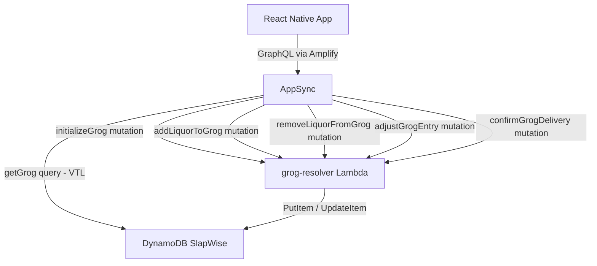

# Design Document: Infinity Grog

## Overview

The Infinity Grog is a shared group drinking vessel tracked per group in SlapWise. One grog exists per group, stored as a single DynamoDB item. When a Manchester debt resolves with an `infinity_grog` punishment, the debtor is shown a dramatic full-screen Sentence Screen and must confirm they took a shot, which triggers proportional removal of entries from the grog. Admins can manage the grog contents at any time via the Review Screen.

The feature is self-contained: a single Lambda (`grog-resolver`) handles all mutations, a new `getGrog` query is resolved via a direct DynamoDB VTL resolver, and the app gains two new screens plus two bottom sheet modals.

## Architecture



**Key decisions:**
- `getGrog` is a direct VTL resolver (GetItem by PK/SK) — no Lambda needed for a simple read.
- All four mutations route to a single `grog-resolver` Lambda. The Lambda inspects `event.info.fieldName` to dispatch to the correct handler. This keeps infra additions minimal (one new Lambda, four new AppSync resolvers).
- No new GSIs — the grog item is always accessed by `PK = GROG#<groupId>`, `SK = METADATA`.

## Components and Interfaces

### Infrastructure

**`grog-resolver` Lambda** (`infrastructure/lambda/grog-resolver/index.ts`)

Handles all four grog mutations. Dispatches on `event.info.fieldName`:

| fieldName | DynamoDB operation |
|---|---|
| `initializeGrog` | `PutItem` with `attribute_not_exists(PK)` condition |
| `addLiquorToGrog` | `UpdateItem` — merge or append entry + append history event |
| `removeLiquorFromGrog` | `UpdateItem` — remove entry by entryId, no history event |
| `adjustGrogEntry` | `UpdateItem` — set entry amountMl or remove if 0, no history event |
| `confirmGrogDelivery` | `UpdateItem` — proportional removal + optional add-back + append shot_taken history event |

Authorization is enforced inside the Lambda by fetching the GROUP#<groupId> METADATA item and checking `adminIds` for mutations that require admin access.

**AppSync resolvers added:**
- `Query.getGrog` → VTL direct DynamoDB GetItem
- `Mutation.initializeGrog` → grog-resolver Lambda
- `Mutation.addLiquorToGrog` → grog-resolver Lambda
- `Mutation.removeLiquorFromGrog` → grog-resolver Lambda
- `Mutation.adjustGrogEntry` → grog-resolver Lambda
- `Mutation.confirmGrogDelivery` → grog-resolver Lambda

### App Services

**`GrogService`** (`app/src/services/GrogService.ts`)

```typescript
export const GrogService = {
  getGrog(groupId: string): Promise<Grog>,
  initializeGrog(groupId: string, bottleSize: number, seedEntries?: AddLiquorInput[]): Promise<Grog>,
  addLiquor(groupId: string, category: LiquorCategory, brand: string): Promise<Grog>,
  removeLiquor(groupId: string, entryId: string): Promise<Grog>,
  adjustGrogEntry(groupId: string, entryId: string, amountMl: number): Promise<Grog>,
  confirmGrogDelivery(groupId: string, debtId: string, addBack?: { category: LiquorCategory; brand: string }): Promise<Grog>,
}
```

Follows the same `generateClient()` + typed cast pattern as `ManchesterService`.

### App Constants

**`app/src/constants/grog.ts`**

```typescript
export const SHOT_ML = 44.36; // 1.5 US fl oz

export const BOTTLE_SIZE_PRESETS = [375, 750, 1000, 1750]; // mL

export const CATEGORY_COLORS: Record<LiquorCategory, string> = {
  vodka:             '#A8D8EA',
  whiskey:           '#C8860A',
  bourbon:           '#B85C00',
  scotch:            '#8B7536',
  irish_whiskey:     '#D4A017',
  canadian_whiskey:  '#E8C97A',
  rum:               '#4A1C00',
  gin:               '#A8D5A2',
  tequila:           '#F0C040',
  brandy:            '#7B1C3E',
  other:             '#7B5EA7',
};

export const LIQUOR_BRANDS: Array<{ brand: string; category: LiquorCategory }> = [
  // vodka
  { brand: 'Grey Goose', category: 'vodka' },
  { brand: 'Absolut', category: 'vodka' },
  { brand: 'Belvedere', category: 'vodka' },
  { brand: "Tito's", category: 'vodka' },
  { brand: 'Ketel One', category: 'vodka' },
  { brand: 'Smirnoff', category: 'vodka' },
  { brand: 'Stolichnaya', category: 'vodka' },
  { brand: 'Ciroc', category: 'vodka' },
  { brand: 'Skyy', category: 'vodka' },
  { brand: 'New Amsterdam', category: 'vodka' },
  { brand: 'Pinnacle', category: 'vodka' },
  { brand: 'Finlandia', category: 'vodka' },
  { brand: 'Chopin', category: 'vodka' },
  { brand: 'Żubrówka', category: 'vodka' },
  { brand: 'Russian Standard', category: 'vodka' },
  { brand: 'Imperia', category: 'vodka' },
  { brand: 'Reyka', category: 'vodka' },
  { brand: 'Deep Eddy', category: 'vodka' },
  { brand: 'Wheatley', category: 'vodka' },
  { brand: 'Prairie', category: 'vodka' },
  // whiskey
  { brand: "Jack Daniel's", category: 'whiskey' },
  { brand: "Jack Daniel's Single Barrel", category: 'whiskey' },
  { brand: 'Johnnie Walker Black', category: 'whiskey' },
  { brand: 'Johnnie Walker Red', category: 'whiskey' },
  { brand: 'Johnnie Walker Blue', category: 'whiskey' },
  { brand: 'Johnnie Walker Gold', category: 'whiskey' },
  { brand: 'Johnnie Walker Green', category: 'whiskey' },
  { brand: 'Seagram\'s 7', category: 'whiskey' },
  { brand: 'Dewar\'s White Label', category: 'whiskey' },
  { brand: 'Dewar\'s 12', category: 'whiskey' },
  { brand: 'Black Velvet', category: 'whiskey' },
  { brand: 'Evan Williams', category: 'whiskey' },
  // bourbon
  { brand: "Maker's Mark", category: 'bourbon' },
  { brand: "Maker's 46", category: 'bourbon' },
  { brand: 'Woodford Reserve', category: 'bourbon' },
  { brand: 'Woodford Reserve Double Oaked', category: 'bourbon' },
  { brand: 'Buffalo Trace', category: 'bourbon' },
  { brand: 'Bulleit', category: 'bourbon' },
  { brand: 'Jim Beam', category: 'bourbon' },
  { brand: 'Jim Beam Black', category: 'bourbon' },
  { brand: 'Knob Creek', category: 'bourbon' },
  { brand: 'Knob Creek Single Barrel', category: 'bourbon' },
  { brand: 'Basil Hayden\'s', category: 'bourbon' },
  { brand: 'Booker\'s', category: 'bourbon' },
  { brand: 'Baker\'s', category: 'bourbon' },
  { brand: 'Four Roses', category: 'bourbon' },
  { brand: 'Four Roses Single Barrel', category: 'bourbon' },
  { brand: 'Wild Turkey 101', category: 'bourbon' },
  { brand: 'Wild Turkey Rare Breed', category: 'bourbon' },
  { brand: 'Russell\'s Reserve', category: 'bourbon' },
  { brand: 'Eagle Rare', category: 'bourbon' },
  { brand: 'Blanton\'s', category: 'bourbon' },
  { brand: 'Pappy Van Winkle 15', category: 'bourbon' },
  { brand: 'Pappy Van Winkle 20', category: 'bourbon' },
  { brand: 'Pappy Van Winkle 23', category: 'bourbon' },
  { brand: 'W.L. Weller', category: 'bourbon' },
  { brand: 'Elijah Craig', category: 'bourbon' },
  { brand: 'Elijah Craig Barrel Proof', category: 'bourbon' },
  { brand: 'Heaven Hill', category: 'bourbon' },
  { brand: 'Old Forester', category: 'bourbon' },
  { brand: 'Old Forester 1920', category: 'bourbon' },
  { brand: 'Larceny', category: 'bourbon' },
  { brand: 'Angel\'s Envy', category: 'bourbon' },
  { brand: 'Jefferson\'s', category: 'bourbon' },
  { brand: 'Michter\'s', category: 'bourbon' },
  { brand: 'Redemption', category: 'bourbon' },
  { brand: 'High West American Prairie', category: 'bourbon' },
  { brand: 'Wilderness Trail', category: 'bourbon' },
  { brand: 'New Riff', category: 'bourbon' },
  { brand: 'Rabbit Hole', category: 'bourbon' },
  // scotch
  { brand: 'Glenfiddich 12', category: 'scotch' },
  { brand: 'Glenfiddich 15', category: 'scotch' },
  { brand: 'Glenfiddich 18', category: 'scotch' },
  { brand: 'Glenfiddich 21', category: 'scotch' },
  { brand: 'Macallan 12', category: 'scotch' },
  { brand: 'Macallan 15', category: 'scotch' },
  { brand: 'Macallan 18', category: 'scotch' },
  { brand: 'Macallan Double Cask', category: 'scotch' },
  { brand: 'Laphroaig 10', category: 'scotch' },
  { brand: 'Laphroaig Quarter Cask', category: 'scotch' },
  { brand: 'Balvenie 12 DoubleWood', category: 'scotch' },
  { brand: 'Balvenie 14 Caribbean Cask', category: 'scotch' },
  { brand: 'Balvenie 21 PortWood', category: 'scotch' },
  { brand: 'Glenlivet 12', category: 'scotch' },
  { brand: 'Glenlivet 15', category: 'scotch' },
  { brand: 'Glenlivet 18', category: 'scotch' },
  { brand: 'Glenmorangie 10', category: 'scotch' },
  { brand: 'Glenmorangie Lasanta', category: 'scotch' },
  { brand: 'Glenmorangie Quinta Ruban', category: 'scotch' },
  { brand: 'Oban 14', category: 'scotch' },
  { brand: 'Dalmore 12', category: 'scotch' },
  { brand: 'Dalmore 15', category: 'scotch' },
  { brand: 'Highland Park 12', category: 'scotch' },
  { brand: 'Highland Park 18', category: 'scotch' },
  { brand: 'Ardbeg 10', category: 'scotch' },
  { brand: 'Ardbeg Uigeadail', category: 'scotch' },
  { brand: 'Bowmore 12', category: 'scotch' },
  { brand: 'Bruichladdich Classic Laddie', category: 'scotch' },
  { brand: 'Caol Ila 12', category: 'scotch' },
  { brand: 'Springbank 10', category: 'scotch' },
  { brand: 'Talisker 10', category: 'scotch' },
  { brand: 'Lagavulin 16', category: 'scotch' },
  { brand: 'Lagavulin 8', category: 'scotch' },
  { brand: 'Auchentoshan Three Wood', category: 'scotch' },
  { brand: 'GlenDronach 12', category: 'scotch' },
  { brand: 'Aberlour 12', category: 'scotch' },
  { brand: 'Aberlour A\'bunadh', category: 'scotch' },
  { brand: 'Craigellachie 13', category: 'scotch' },
  { brand: 'Benriach 10', category: 'scotch' },
  // irish_whiskey
  { brand: 'Jameson', category: 'irish_whiskey' },
  { brand: 'Jameson Black Barrel', category: 'irish_whiskey' },
  { brand: 'Jameson Caskmates', category: 'irish_whiskey' },
  { brand: 'Bushmills', category: 'irish_whiskey' },
  { brand: 'Bushmills Black Bush', category: 'irish_whiskey' },
  { brand: 'Bushmills 10', category: 'irish_whiskey' },
  { brand: 'Redbreast 12', category: 'irish_whiskey' },
  { brand: 'Redbreast 15', category: 'irish_whiskey' },
  { brand: 'Redbreast Lustau', category: 'irish_whiskey' },
  { brand: 'Tullamore D.E.W.', category: 'irish_whiskey' },
  { brand: 'Tullamore D.E.W. 14', category: 'irish_whiskey' },
  { brand: 'Powers', category: 'irish_whiskey' },
  { brand: 'Powers John\'s Lane', category: 'irish_whiskey' },
  { brand: 'Green Spot', category: 'irish_whiskey' },
  { brand: 'Yellow Spot', category: 'irish_whiskey' },
  { brand: 'Teeling Small Batch', category: 'irish_whiskey' },
  { brand: 'Teeling Single Grain', category: 'irish_whiskey' },
  { brand: 'Teeling Single Malt', category: 'irish_whiskey' },
  { brand: 'Slane', category: 'irish_whiskey' },
  { brand: 'Connemara', category: 'irish_whiskey' },
  { brand: 'Knappogue Castle', category: 'irish_whiskey' },
  { brand: 'Tyrconnell', category: 'irish_whiskey' },
  { brand: 'Kilbeggan', category: 'irish_whiskey' },
  { brand: 'Writers\' Tears', category: 'irish_whiskey' },
  { brand: 'Midleton Very Rare', category: 'irish_whiskey' },
  // canadian_whiskey
  { brand: 'Crown Royal', category: 'canadian_whiskey' },
  { brand: 'Crown Royal Apple', category: 'canadian_whiskey' },
  { brand: 'Crown Royal Peach', category: 'canadian_whiskey' },
  { brand: 'Crown Royal XR', category: 'canadian_whiskey' },
  { brand: 'Canadian Club', category: 'canadian_whiskey' },
  { brand: 'Canadian Club 12', category: 'canadian_whiskey' },
  { brand: 'Forty Creek', category: 'canadian_whiskey' },
  { brand: 'Forty Creek Confederation Oak', category: 'canadian_whiskey' },
  { brand: 'Pendleton', category: 'canadian_whiskey' },
  { brand: 'Pendleton 1910', category: 'canadian_whiskey' },
  { brand: 'Lot 40', category: 'canadian_whiskey' },
  { brand: 'Pike Creek', category: 'canadian_whiskey' },
  { brand: 'Gooderham & Worts', category: 'canadian_whiskey' },
  { brand: 'J.P. Wiser\'s', category: 'canadian_whiskey' },
  { brand: 'Wiser\'s 18', category: 'canadian_whiskey' },
  { brand: 'Alberta Premium', category: 'canadian_whiskey' },
  { brand: 'Alberta Premium Cask Strength', category: 'canadian_whiskey' },
  { brand: 'Caribou Crossing', category: 'canadian_whiskey' },
  // rum
  { brand: 'Bacardi Superior', category: 'rum' },
  { brand: 'Bacardi Gold', category: 'rum' },
  { brand: 'Bacardi 8', category: 'rum' },
  { brand: 'Bacardi Oakheart', category: 'rum' },
  { brand: 'Captain Morgan Original', category: 'rum' },
  { brand: 'Captain Morgan Black', category: 'rum' },
  { brand: 'Captain Morgan 100', category: 'rum' },
  { brand: 'Havana Club 3', category: 'rum' },
  { brand: 'Havana Club 7', category: 'rum' },
  { brand: 'Mount Gay Eclipse', category: 'rum' },
  { brand: 'Mount Gay XO', category: 'rum' },
  { brand: 'Diplomatico Reserva Exclusiva', category: 'rum' },
  { brand: 'Diplomatico Planas', category: 'rum' },
  { brand: 'Appleton Estate', category: 'rum' },
  { brand: 'Appleton Estate 12', category: 'rum' },
  { brand: 'Appleton Estate 21', category: 'rum' },
  { brand: 'Plantation 3 Stars', category: 'rum' },
  { brand: 'Plantation Original Dark', category: 'rum' },
  { brand: 'Plantation XO', category: 'rum' },
  { brand: 'Ron Zacapa 23', category: 'rum' },
  { brand: 'Ron Zacapa XO', category: 'rum' },
  { brand: 'Flor de Caña 7', category: 'rum' },
  { brand: 'Flor de Caña 12', category: 'rum' },
  { brand: 'Flor de Caña 18', category: 'rum' },
  { brand: 'El Dorado 12', category: 'rum' },
  { brand: 'El Dorado 15', category: 'rum' },
  { brand: 'Gosling\'s Black Seal', category: 'rum' },
  { brand: 'Myers\'s Dark', category: 'rum' },
  { brand: 'Kraken', category: 'rum' },
  { brand: 'Sailor Jerry', category: 'rum' },
  { brand: 'Malibu', category: 'rum' },
  { brand: 'Angostura 1919', category: 'rum' },
  { brand: 'Angostura 7', category: 'rum' },
  { brand: 'Brugal 1888', category: 'rum' },
  { brand: 'Don Q Cristal', category: 'rum' },
  // gin
  { brand: "Hendrick's", category: 'gin' },
  { brand: "Hendrick's Orbium", category: 'gin' },
  { brand: 'Tanqueray', category: 'gin' },
  { brand: 'Tanqueray No. Ten', category: 'gin' },
  { brand: 'Tanqueray Rangpur', category: 'gin' },
  { brand: 'Bombay Sapphire', category: 'gin' },
  { brand: 'Bombay Sapphire East', category: 'gin' },
  { brand: 'Beefeater', category: 'gin' },
  { brand: 'Beefeater 24', category: 'gin' },
  { brand: 'The Botanist', category: 'gin' },
  { brand: 'Monkey 47', category: 'gin' },
  { brand: 'Aviation', category: 'gin' },
  { brand: 'Roku', category: 'gin' },
  { brand: 'Sipsmith', category: 'gin' },
  { brand: 'Sipsmith VJOP', category: 'gin' },
  { brand: 'Malfy Con Limone', category: 'gin' },
  { brand: 'Malfy Con Arancia', category: 'gin' },
  { brand: 'Malfy Originale', category: 'gin' },
  { brand: 'Empress 1908', category: 'gin' },
  { brand: 'St. George Terroir', category: 'gin' },
  { brand: 'St. George Botanivore', category: 'gin' },
  { brand: 'Nolet\'s Silver', category: 'gin' },
  { brand: 'Plymouth', category: 'gin' },
  { brand: 'Gordon\'s', category: 'gin' },
  { brand: 'Seagram\'s Extra Dry', category: 'gin' },
  { brand: 'Drumshanbo Gunpowder', category: 'gin' },
  { brand: 'Hayman\'s Old Tom', category: 'gin' },
  { brand: 'Citadelle', category: 'gin' },
  { brand: 'Bluecoat', category: 'gin' },
  // tequila
  { brand: 'Patrón Silver', category: 'tequila' },
  { brand: 'Patrón Reposado', category: 'tequila' },
  { brand: 'Patrón Añejo', category: 'tequila' },
  { brand: 'Patrón Extra Añejo', category: 'tequila' },
  { brand: 'Don Julio Blanco', category: 'tequila' },
  { brand: 'Don Julio Reposado', category: 'tequila' },
  { brand: 'Don Julio Añejo', category: 'tequila' },
  { brand: 'Don Julio 1942', category: 'tequila' },
  { brand: 'Don Julio 70', category: 'tequila' },
  { brand: 'Casamigos Blanco', category: 'tequila' },
  { brand: 'Casamigos Reposado', category: 'tequila' },
  { brand: 'Casamigos Añejo', category: 'tequila' },
  { brand: 'Jose Cuervo Especial', category: 'tequila' },
  { brand: 'Jose Cuervo Tradicional', category: 'tequila' },
  { brand: 'Espolòn Blanco', category: 'tequila' },
  { brand: 'Espolòn Reposado', category: 'tequila' },
  { brand: 'Herradura Silver', category: 'tequila' },
  { brand: 'Herradura Reposado', category: 'tequila' },
  { brand: 'Herradura Añejo', category: 'tequila' },
  { brand: 'El Jimador Blanco', category: 'tequila' },
  { brand: 'El Jimador Reposado', category: 'tequila' },
  { brand: 'Olmeca Altos Plata', category: 'tequila' },
  { brand: 'Olmeca Altos Reposado', category: 'tequila' },
  { brand: 'Clase Azul Reposado', category: 'tequila' },
  { brand: 'Clase Azul Añejo', category: 'tequila' },
  { brand: 'Fortaleza Blanco', category: 'tequila' },
  { brand: 'Fortaleza Reposado', category: 'tequila' },
  { brand: 'Fortaleza Añejo', category: 'tequila' },
  { brand: 'Siete Leguas Blanco', category: 'tequila' },
  { brand: 'G4 Blanco', category: 'tequila' },
  { brand: 'Tequila Ocho Plata', category: 'tequila' },
  { brand: 'Arette Blanco', category: 'tequila' },
  { brand: 'Tapatio Blanco', category: 'tequila' },
  { brand: '1800 Silver', category: 'tequila' },
  { brand: '1800 Reposado', category: 'tequila' },
  { brand: '1800 Añejo', category: 'tequila' },
  { brand: 'Hornitos Plata', category: 'tequila' },
  { brand: 'Sauza Blue Silver', category: 'tequila' },
  // brandy
  { brand: 'Hennessy VS', category: 'brandy' },
  { brand: 'Hennessy VSOP', category: 'brandy' },
  { brand: 'Hennessy XO', category: 'brandy' },
  { brand: 'Rémy Martin VSOP', category: 'brandy' },
  { brand: 'Rémy Martin XO', category: 'brandy' },
  { brand: 'Rémy Martin 1738', category: 'brandy' },
  { brand: 'Courvoisier VS', category: 'brandy' },
  { brand: 'Courvoisier VSOP', category: 'brandy' },
  { brand: 'Courvoisier XO', category: 'brandy' },
  { brand: 'Martell VS', category: 'brandy' },
  { brand: 'Martell VSOP', category: 'brandy' },
  { brand: 'Martell Cordon Bleu', category: 'brandy' },
  { brand: 'E&J VS', category: 'brandy' },
  { brand: 'E&J VSOP', category: 'brandy' },
  { brand: 'E&J XO', category: 'brandy' },
  { brand: 'Paul Masson VSOP', category: 'brandy' },
  { brand: 'Korbel', category: 'brandy' },
  { brand: 'Christian Brothers', category: 'brandy' },
  { brand: 'Torres 10', category: 'brandy' },
  { brand: 'Torres 20', category: 'brandy' },
  { brand: 'Calvados Père Magloire', category: 'brandy' },
  { brand: 'Armagnac Delord', category: 'brandy' },
  { brand: 'Armagnac Tariquet', category: 'brandy' },
  { brand: 'Pisco Portón', category: 'brandy' },
  { brand: 'Pisco Capel', category: 'brandy' },
];
```

### App Screens

**`InfinityGrogSentenceScreen`** (`app/src/screens/InfinityGrogSentenceScreen.tsx`)
- Full-screen dark background modal
- Fetches grog + group members in parallel via `Promise.all` on mount
- Skull SVG drops in with `withSpring` entry animation
- Slosh animation runs continuously via `useSharedValue` + `withRepeat(withTiming(...))`
- "Take the Shot" CTA triggers `confirmGrogDelivery` then navigates back

**`InfinityGrogReviewScreen`** (`app/src/screens/InfinityGrogReviewScreen.tsx`)
- Standard screen (not full-screen modal)
- Skull SVG static (no drop animation)
- Fetches grog + group members in parallel on mount
- Admin controls: "Add Liquor" button opens `AddLiquorSheet`, per-entry remove button calls `removeLiquor`, per-entry editable volume field calls `adjustGrogEntry`
- "Initialize Grog" button shown when admin and no grog exists

**`InitializeGrogSheet`** (bottom sheet modal, rendered inside Review Screen)
- Numeric input for bottle size with oz/mL toggle; converts oz → mL before storing
- Preset buttons: 375 mL, 750 mL, 1000 mL, 1750 mL
- Optional multi-entry seed liquors using same brand typeahead + category selector

**`AddLiquorSheet`** (bottom sheet modal, used in both Review Screen and Sentence Screen add-back flow)
- Brand text input with typeahead filtering against `LIQUOR_BRANDS`
- Selecting a suggestion auto-fills brand + category
- Category selector always editable (override allowed)
- Validates: non-empty brand + category selected before submitting

### Skull SVG Component

**`GrogSkull`** (`app/src/screens/components/GrogSkull.tsx`)

Built with `react-native-svg`. Structure:

```
<Svg>
  <Defs>
    <ClipPath id="skull-clip">
      <Path d={SKULL_PATH} />   {/* stylized icon-like skull outline */}
    </ClipPath>
  </Defs>

  {/* Liquid layers — bottom to top, each category a colored rect */}
  <G clipPath="url(#skull-clip)">
    {layers.map(layer => (
      <Rect key={layer.category} ... fill={CATEGORY_COLORS[layer.category]} />
    ))}
    {/* Slosh wave on top edge of liquid — quadratic bezier Path driven by sharedValue */}
    <AnimatedPath d={animatedWavePath} fill={topLayerColor} />
  </G>

  {/* Skull outline on top */}
  <Path d={SKULL_PATH} stroke="#fff" strokeWidth={2} fill="none" />
</Svg>
```

Layer heights are computed as:
```
totalAmountMl  = sum(entry.amountMl for all entries)
fillLevel      = totalAmountMl / bottleSize           (clamped to [0, 1])
layerHeightPx  = (entry.amountMl / totalAmountMl) * fillLevel * SKULL_HEIGHT
```

The slosh animation uses a `useSharedValue(0)` driven by `withRepeat(withTiming(2 * Math.PI, { duration: 2000 }))`. The wave path is a `useDerivedValue` that computes a quadratic bezier offset: `Q cx,cy ex,ey` where `cy` oscillates as `Math.sin(phase) * SLOSH_AMPLITUDE`.

## Data Models

### DynamoDB Item: GROG

| Attribute | Type | Notes |
|---|---|---|
| PK | String | `GROG#<groupId>` |
| SK | String | `METADATA` |
| groupId | String | UUID |
| bottleSize | Number | mL, float |
| entries | List | `GrogEntry[]` (DynamoDB List of Maps) |
| history | List | `GrogHistoryEvent[]` (DynamoDB List of Maps) |
| createdAt | String | ISO8601 |
| createdBy | String | playerId |

### GrogEntry (Map inside entries list)

Represents the **current state** of a liquor in the grog. Player attribution lives in history, not here.

| Attribute | Type | Notes |
|---|---|---|
| entryId | String | UUID — stable identifier for this brand/category slot |
| category | String | `LiquorCategory` enum value |
| brand | String | |
| amountMl | Number | Current remaining volume in mL (float). Increases when the same brand is added again. Decreases proportionally on each shot delivery. |

### GrogHistoryEvent (Map inside history list)

The immutable log of everything that happened to the grog. This is where all player attribution lives.

| Attribute | Type | Notes |
|---|---|---|
| eventId | String | UUID |
| type | String | `'addition'` — someone added a liquor; `'shot_taken'` — someone took a shot |
| actorPlayerId | String | playerId of who performed the action |
| occurredAt | String | ISO8601 |
| sourceDebtId | String \| null | debtId if triggered by a punishment |
| brand | String \| null | Brand added — present on `addition` events only |
| category | String \| null | Category added — present on `addition` events only |
| amountMl | Number \| null | Volume added or removed — present on both event types |

### TypeScript Types (app/src/types/index.ts additions)

```typescript
export type LiquorCategory =
  | 'vodka' | 'whiskey' | 'bourbon' | 'scotch'
  | 'irish_whiskey' | 'canadian_whiskey' | 'rum'
  | 'gin' | 'tequila' | 'brandy' | 'other';

export type GrogHistoryEventType = 'addition' | 'shot_taken';

export interface GrogEntry {
  entryId: string;
  category: LiquorCategory;
  brand: string;
  amountMl: number;       // remaining volume in mL — decreases proportionally on each shot
}

export interface GrogHistoryEvent {
  eventId: string;
  type: GrogHistoryEventType;
  actorPlayerId: string;
  occurredAt: string;
  sourceDebtId: string | null;
  // addition events only:
  brand: string | null;
  category: LiquorCategory | null;
  amountMl: number | null;
}

export interface Grog {
  groupId: string;
  bottleSize: number;
  entries: GrogEntry[];
  history: GrogHistoryEvent[];
}
```

### GraphQL Schema Additions

```graphql
enum LiquorCategory {
  vodka
  whiskey
  bourbon
  scotch
  irish_whiskey
  canadian_whiskey
  rum
  gin
  tequila
  brandy
  other
}

type GrogEntry {
  entryId: ID!
  category: LiquorCategory!
  brand: String!
  amountMl: Float!
}

type GrogHistoryEvent {
  eventId: ID!
  type: String!          # 'addition' | 'shot_taken'
  actorPlayerId: ID!
  occurredAt: AWSDateTime!
  sourceDebtId: ID
  brand: String          # addition events only
  category: LiquorCategory  # addition events only
  amountMl: Float        # both event types
}

type Grog {
  groupId: ID!
  bottleSize: Float!
  entries: [GrogEntry!]!
  history: [GrogHistoryEvent!]!
}

input AddLiquorInput {
  category: LiquorCategory!
  brand: String!
}

# Added to Query type:
getGrog(groupId: ID!): Grog

# Added to Mutation type:
initializeGrog(groupId: ID!, bottleSize: Float!, seedEntries: [AddLiquorInput!]): Grog!
addLiquorToGrog(groupId: ID!, category: LiquorCategory!, brand: String!): Grog!
removeLiquorFromGrog(groupId: ID!, entryId: ID!): Grog!
confirmGrogDelivery(groupId: ID!, debtId: ID!, addBack: AddLiquorInput): Grog!
adjustGrogEntry(groupId: ID!, entryId: ID!, amountMl: Float!): Grog!
```

Note: `bottleSize` is `Float!` in GraphQL (not `Int!`) to match the mL float storage.

### Proportional Removal Algorithm

The grog is treated as a fully mixed vessel. Taking one shot (44.36 mL) removes that volume proportionally from every entry.

When `confirmGrogDelivery` is called:

1. Fetch current `entries` list from DynamoDB.
2. `totalAmountMl = sum of all entry.amountMl`. If 0, no removal needed — return unchanged.
3. For each entry, subtract `SHOT_ML * (entry.amountMl / totalAmountMl)` from `entry.amountMl`.
4. Remove any entries whose `amountMl` has dropped to ≤ 0 (or below a minimum threshold of 0.01 mL to handle float precision).
5. Append exactly one `shot_taken` GrogHistoryEvent with `actorPlayerId` = debtor, `amountMl` = `SHOT_ML`, and `sourceDebtId` = `debtId`.
6. If `addBack` is provided:
   - Check if an entry with the same `brand` and `category` already exists.
   - If yes: add `SHOT_ML` to that entry's `amountMl`.
   - If no: create a new GrogEntry with `amountMl = SHOT_ML`, `sourceDebtId = debtId`.
   - Append an `addition` GrogHistoryEvent.
7. Write all changes atomically via a single `UpdateItem` that replaces the entire `entries` list and appends to `history`.

**Duplicate brand handling (addLiquorToGrog):**
- Before appending a new entry, check if an entry with the same `brand` and `category` already exists.
- If yes: add `SHOT_ML` (44.36 mL) to that entry's `amountMl` — no new entry created.
- If no: create a new entry with `amountMl = SHOT_ML`.
- Either way, append one `addition` GrogHistoryEvent.

**Fill level and layer proportions:**
```
totalAmountMl = sum(entry.amountMl for all entries)
fillLevel     = totalAmountMl / bottleSize          (clamped to [0, 1])
layerFraction = entry.amountMl / totalAmountMl      (per entry, for skull visualization)
```

### Navigation Types Addition

```typescript
// Added to RootStackParamList:
InfinityGrogSentence: { debtId: string; groupId: string; groupName: string };
InfinityGrogReview: { groupId: string; groupName: string };
```


## Correctness Properties

*A property is a characteristic or behavior that should hold true across all valid executions of a system — essentially, a formal statement about what the system should do. Properties serve as the bridge between human-readable specifications and machine-verifiable correctness guarantees.*

### Property 1: Grog data model completeness

*For any* Grog object returned by the system, it must contain `groupId`, `bottleSize`, `entries`, and `history`. *For any* GrogEntry in that list, it must contain `entryId`, `category`, `brand`, and `amountMl`. *For any* GrogHistoryEvent in that list, it must contain `eventId`, `type`, `actorPlayerId`, and `occurredAt`.

**Validates: Requirements 1.2, 1.3, 1.4**

### Property 2: Add liquor merges duplicate brands, grows history by 1

*For any* grog state and any valid `(category, brand)` pair:
- If no entry with that `brand` + `category` exists: `entries.length` increases by 1, the new entry has `amountMl = SHOT_ML`.
- If an entry with that `brand` + `category` already exists: `entries.length` is unchanged, that entry's `amountMl` increases by `SHOT_ML`.
- In both cases `history.length` increases by exactly 1 with `type = 'addition'`.

**Validates: Requirements 2.1**

### Property 3: Remove liquor shrinks entries, no history event written

*For any* grog state with at least one entry, calling `removeLiquorFromGrog` with an existing `entryId` should result in `entries.length` decreasing by exactly 1 and `history.length` remaining unchanged (admin corrections do not produce history events).

**Validates: Requirements 2.2, 12.3**

### Property 4: Authorization rejects non-admin mutations

*For any* grog mutation (`initializeGrog`, `addLiquorToGrog`, `removeLiquorFromGrog`) called by a player whose `playerId` does not appear in the group's `adminIds`, the resolver should return an authorization error and leave the grog state unchanged.

**Validates: Requirements 2.3, 11.5**

### Property 5: Shot delivery reduces all entry amounts proportionally

*For any* non-empty grog state with `totalAmountMl > 0`, calling `confirmGrogDelivery` should reduce each entry's `amountMl` by `SHOT_ML * (entry.amountMl / totalAmountMl)`. Entries whose resulting `amountMl` drops to ≤ 0 are removed. The new `totalAmountMl` after removal equals `max(0, previousTotalAmountMl - SHOT_ML)`.

**Validates: Requirements 3.1, 3.2**

### Property 6: Shot delivery appends exactly one shot_taken history event

*For any* non-empty grog state, calling `confirmGrogDelivery` should append exactly one `shot_taken` GrogHistoryEvent with `amountMl = SHOT_ML` and `sourceDebtId` equal to the `debtId` argument, regardless of how many entries were depleted.

**Validates: Requirements 3.3**

### Property 7: Shot delivery with add-back records both events; duplicate brand merges

*For any* non-empty grog state and any valid `addBack` input, calling `confirmGrogDelivery` with `addBack` should:
- Apply proportional removal first
- Then either merge `SHOT_ML` into an existing matching entry or create a new one
- Result in `history.length` increasing by at least 1 (removal events) + 1 (addition event)
- The added/merged entry's `sourceDebtId` equals the `debtId` argument

**Validates: Requirements 3.4, 3.5**

### Property 8: getGrog round-trip returns added entries

*For any* sequence of `addLiquorToGrog` calls followed by `getGrog`, the returned `entries` list should contain all entries that were added, with matching `category`, `brand`, and `amountMl` values (accounting for merges).

**Validates: Requirements 4.1**

### Property 9: Layer computation produces proportional heights summing to fill level

*For any* grog state with `totalAmountMl > 0` and `bottleSize > 0`, the computed liquid layers should satisfy: (a) each layer's height fraction equals `entry.amountMl / totalAmountMl`, (b) the sum of all layer height fractions equals 1.0, (c) the overall fill level equals `totalAmountMl / bottleSize` clamped to [0, 1], and (d) each layer's color matches `CATEGORY_COLORS[category]`.

**Validates: Requirements 6.3, 6.5, 11.8**

### Property 10: Player ID resolution uses member map

*For any* grog history event and any member map, the displayed actor name should equal `memberMap[actorPlayerId].username ?? actorPlayerId` — never the raw `actorPlayerId` string when a username is available.

**Validates: Requirements 6.8, 7.6**

### Property 11: Typeahead filtering returns only matching suggestions

*For any* non-empty input string, the typeahead filter function should return only entries from `LIQUOR_BRANDS` whose `brand` field contains the input string (case-insensitive), and should return an empty array when no brands match.

**Validates: Requirements 8.2**

### Property 12: Validation rejects empty or whitespace-only brand names

*For any* string composed entirely of whitespace characters (including the empty string), the Add Liquor form validation should reject it and not invoke `addLiquor`.

**Validates: Requirements 8.6**

### Property 13: initializeGrog creates entries and history matching seedEntries

*For any* valid `bottleSize` and `seedEntries` list where `seedEntries.length * SHOT_ML <= bottleSize`, calling `initializeGrog` should produce a grog where `entries.length === seedEntries.length`, `history.length === seedEntries.length`, and every history event has `type = 'addition'`.

**Validates: Requirements 11.1**

### Property 14: initializeGrog rejects seedEntries that overflow bottleSize

*For any* `bottleSize` and `seedEntries` list where `seedEntries.length * SHOT_ML > bottleSize`, calling `initializeGrog` should return a validation error and not create the grog item.

**Validates: Requirements 11.3**

## Error Handling

### Lambda (`grog-resolver`)

| Error condition | Response |
|---|---|
| Non-admin calls admin mutation | `{ error: 'UNAUTHORIZED', message: 'Admin access required' }` |
| `removeLiquorFromGrog` with unknown `entryId` | `{ error: 'NOT_FOUND', message: 'Entry not found' }` |
| `adjustGrogEntry` with unknown `entryId` | `{ error: 'NOT_FOUND', message: 'Entry not found' }` |
| `adjustGrogEntry` with negative `amountMl` | `{ error: 'VALIDATION_ERROR', message: 'amountMl must be >= 0' }` |
| `initializeGrog` when grog already exists | DynamoDB `ConditionalCheckFailedException` caught → `{ error: 'ALREADY_EXISTS' }` |
| `initializeGrog` with seedEntries overflow | `{ error: 'VALIDATION_ERROR', message: 'Seed entries exceed bottle capacity' }` |
| `confirmGrogDelivery` on empty grog | No-op — return current grog state unchanged |
| Unknown `fieldName` in event | `{ error: 'UNKNOWN_FIELD' }` |
| DynamoDB errors | Logged via `console.error('[grog-resolver] fieldName:', err)`, re-thrown |

### App (`GrogService` / screens)

- All service errors are caught in screens, logged with `console.error('[ScreenName] context:', err)`, and surfaced as user-facing alert messages.
- `getGrog` returning null (no grog initialized) is handled gracefully — screens show the "Initialize Grog" prompt rather than an error state.
- Network errors during `confirmGrogDelivery` do not navigate away — the user can retry.

## Testing Strategy

### Dual Testing Approach

Both unit tests and property-based tests are required. Unit tests cover specific examples and integration points; property tests verify universal correctness across randomized inputs.

### Property-Based Testing

Library: **fast-check** (already in the project at `app/src/tests/`).

Each property test runs a minimum of 100 iterations. Tests are tagged with a comment referencing the design property.

**Arbitraries needed:**
- `fc.constantFrom(...LIQUOR_CATEGORIES)` for `LiquorCategory`
- `fc.record({ entryId: fc.uuid(), category: liquorCategoryArb, brand: fc.string({ minLength: 1 }), amountMl: fc.float({ min: 0.01, max: 750 }) })` for `GrogEntry`
- `fc.array(grogEntryArb, { minLength: 1 })` for non-empty `entries`
- `fc.float({ min: 375, max: 1750 })` for `bottleSize`

**Property tests to implement** (one test per property, in `app/src/tests/grog.test.ts`):

| Test | Design Property | Tag |
|---|---|---|
| Grog shape has all required fields | P1 | `Feature: infinity-grog, Property 1` |
| addLiquor merges duplicate brands, history grows by 1 | P2 | `Feature: infinity-grog, Property 2` |
| removeLiquor shrinks entries, history unchanged | P3 | `Feature: infinity-grog, Property 3` |
| Non-admin mutations return auth error | P4 | `Feature: infinity-grog, Property 4` |
| confirmDelivery reduces all amountMl proportionally | P5 | `Feature: infinity-grog, Property 5` |
| confirmDelivery appends exactly one shot_taken event | P6 | `Feature: infinity-grog, Property 6` |
| confirmDelivery with addBack: merges/creates entry, 2 history events | P7 | `Feature: infinity-grog, Property 7` |
| Layer heights proportional and sum to fillLevel | P9 | `Feature: infinity-grog, Property 9` |
| Player ID resolution uses member map | P10 | `Feature: infinity-grog, Property 10` |
| Typeahead returns only matching brands | P11 | `Feature: infinity-grog, Property 11` |
| Whitespace brand rejected | P12 | `Feature: infinity-grog, Property 12` |
| initializeGrog with seedEntries: entries+history match | P13 | `Feature: infinity-grog, Property 13` |
| initializeGrog overflow returns error | P14 | `Feature: infinity-grog, Property 14` |

Note: P8 (getGrog round-trip) is an integration-level property best covered by an integration test against a real or mocked DynamoDB, not a fast-check unit test.

### Unit Tests

Focus on specific examples and edge cases:

- `SHOT_ML === 44.36` constant check (Req 11.2)
- `LIQUOR_BRANDS` contains at least one entry for each of the 11 `LiquorCategory` values (Req 8.7)
- `initializeGrog` called twice returns `ALREADY_EXISTS` error on second call (Req 11.4)
- `confirmGrogDelivery` on a grog with 0 total mL returns unchanged state (edge case)
- `getGrog` when no item exists returns `{ entries: [], history: [] }` (Req 4.2)
- Proportional removal: 3 entries with amountMl [20, 10, 14.36] — after one shot (44.36 mL total), each reduces by `44.36 * (x/44.36) = x`, resulting in all entries at 0 and being removed
- Duplicate brand merge: adding "Jameson" twice results in one entry with `amountMl = 88.72`
- Fill level clamped to 1.0 when totalAmountMl exceeds bottleSize (defensive)
- oz → mL conversion: `oz * 29.5735 ≈ mL` (UI unit toggle)
