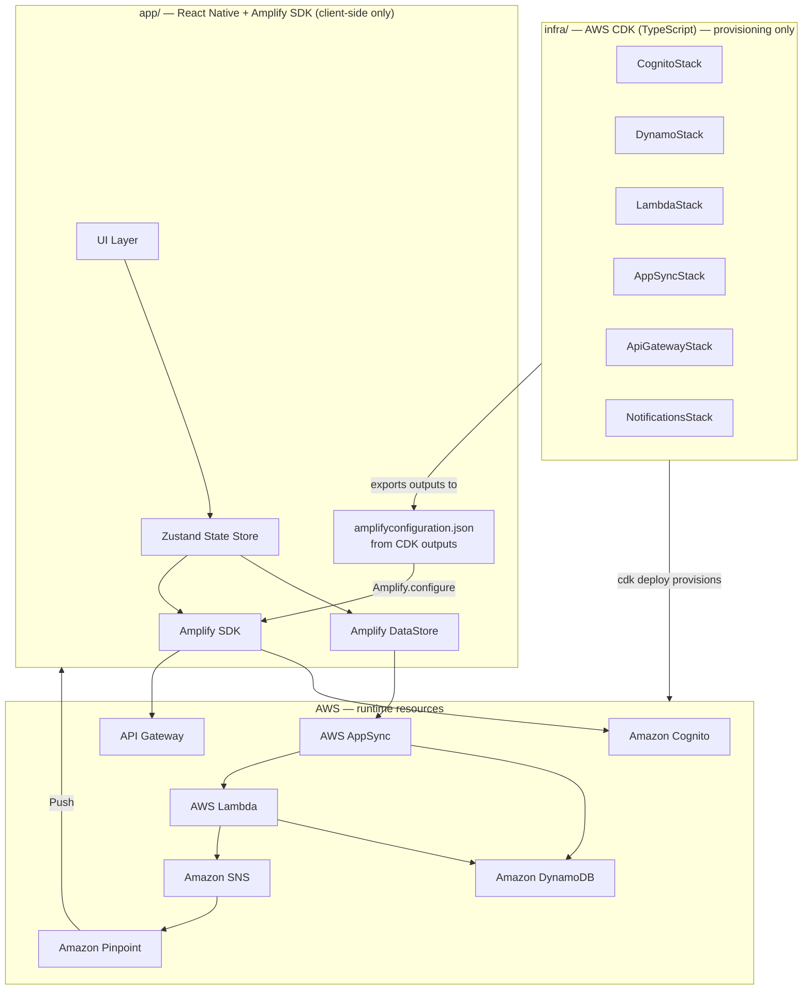

# Design Document: Social Slap Tracker

## Overview

Social Slap Tracker is a mobile app for tracking silly social games among friends. The core mechanic is "Manchester" — a challenge game where players bet slaps on declarative statements — but the app generalises to support custom games, a gated "Read In" game with chug events, a slap debt ledger with two-party delivery confirmation, and a group activity feed.

The app is built as a cross-platform mobile application (React Native) backed by an AWS cloud backend. The stack uses Amazon Cognito for authentication, AWS AppSync (GraphQL) with DynamoDB for real-time data sync, Amazon SNS + Pinpoint for push notifications, AWS Lambda for backend logic, and AWS Amplify DataStore for offline support.

### Key Design Decisions

- **AWS CDK (TypeScript) for all infrastructure provisioning**: All AWS resources — Cognito User Pool + Identity Pool, AppSync API + schema + resolvers, DynamoDB table with GSIs, Lambda functions, API Gateway, SNS topics, Pinpoint app, and IAM roles/policies — are defined and deployed via AWS CDK stacks in a dedicated `infra/` directory. The `infra/` directory is a standalone TypeScript CDK project that lives alongside the React Native app (e.g. at the repo root: `infra/` and `app/`). There is no `amplify init`, `amplify push`, or any Amplify CLI involvement in infrastructure provisioning.
- **AWS AppSync + DynamoDB**: AppSync provides real-time GraphQL subscriptions that replace Firestore real-time listeners, giving sub-5-second sync out of the box. DynamoDB single-table design supports all required access patterns efficiently.
- **Amazon Cognito**: Handles user registration, authentication, and session management. A post-confirmation Lambda trigger enforces username uniqueness and writes the player profile to DynamoDB. The Cognito User Pool and Identity Pool are provisioned via the CDK `CognitoStack`.
- **AWS Amplify SDK + DataStore (client-side only)**: The Amplify SDK is used exclusively on the React Native client for auth (Cognito), AppSync GraphQL calls, DataStore (offline), and Pinpoint push token registration. It is configured manually via an `amplifyconfiguration.json` (or an `Amplify.configure()` call) generated from CDK stack outputs — never from the Amplify CLI. CDK stack outputs (e.g. `UserPoolId`, `UserPoolClientId`, `AppSyncEndpoint`, `PinpointAppId`) are exported and used to populate this config. DataStore queues writes locally and syncs on reconnect.
- **AWS Lambda**: Handles multi-step atomic operations — joining groups, resolving debts, confirming delivery, voiding debts on leave — where a single GraphQL mutation is insufficient. All Lambda function definitions, IAM roles, and environment variables are declared in the CDK `LambdaStack`; implementation tasks write handler code only.
- **Amazon SNS + Pinpoint**: SNS topics fan out notifications to device endpoints registered via Pinpoint. In-app inbox notifications are written to DynamoDB when push is disabled. SNS topics, Pinpoint app, and associated IAM roles are provisioned via the CDK `NotificationsStack`.
- **Two-party confirmation pattern**: Both Manchester resolution and slap delivery require independent confirmation from both parties. A Lambda resolver checks both confirmations and advances the debt state atomically using a DynamoDB conditional write.
- **Read In gating via AppSync resolvers**: Read In status is stored per-player per-group in DynamoDB and enforced both client-side (UI gating) and server-side (AppSync VTL/Lambda resolvers). Chug event details are stored with a `readInOnly` flag and filtered by resolver based on the caller's read-in status. The AppSync API, schema, data sources, and resolver attachments are declared in the CDK `AppSyncStack`; implementation tasks write resolver logic (VTL or Lambda handler) only.
- **Invite codes**: Short alphanumeric codes stored in DynamoDB with optional TTL. Joining a group is a Lambda function that validates the code and adds the player atomically using a DynamoDB transaction. The DynamoDB table with all GSIs and TTL configuration is provisioned via the CDK `DynamoStack`.

---

## Architecture

> **Project layout**: The repository contains two top-level directories — `infra/` (standalone AWS CDK TypeScript project that provisions all AWS resources) and `app/` (React Native project). The Amplify SDK is used client-side only inside `app/`; it is configured manually using outputs exported by the CDK stacks, not by the Amplify CLI.



### Data Flow

1. User actions hit the Zustand store, which calls Amplify DataStore or AppSync GraphQL mutations directly.
2. AppSync real-time subscriptions push updates back to the store, which re-renders the UI.
3. Lambda resolvers handle multi-step atomic operations: joining groups, resolving debts, confirming delivery, voiding debts on leave.
4. Lambda functions also dispatch SNS/Pinpoint push notifications on relevant events.
5. Offline: Amplify DataStore caches the last known state locally. Writes are queued and flushed on reconnect via AppSync delta sync.

---

## Components and Interfaces

### Authentication Module

Wraps Amazon Cognito via Amplify Auth. Exposes:

```ts
interface AuthService {
  register(username: string, email: string, password: string): Promise<void>
  login(email: string, password: string): Promise<void>
  logout(): Promise<void>
  currentPlayer(): Player | null
}
```

Username uniqueness is enforced via a DynamoDB `usernames` item (PK: `USERNAME#<username>`) checked in a Cognito pre-sign-up Lambda trigger. If the username is taken, the trigger throws an error and Cognito rejects the registration. On successful confirmation, a post-confirmation trigger writes the player profile to DynamoDB.

### Group Service

```ts
interface GroupService {
  createGroup(name: string): Promise<Group>
  joinGroup(inviteCode: string): Promise<Group>
  getGroups(): Observable<Group[]>
  getGroupMembers(groupId: string): Observable<Player[]>
  designateAdmin(groupId: string, playerId: string): Promise<void>
  leaveGroup(groupId: string): Promise<void>
  regenerateInviteCode(groupId: string): Promise<string>
}
```

`createGroup` and `joinGroup` are Lambda functions invoked via API Gateway. `getGroups` and `getGroupMembers` use AppSync subscriptions backed by DynamoDB queries.

### Manchester Service

```ts
interface ManchesterService {
  createChallenge(groupId: string, statementMakerId: string, statement: string): Promise<SlapDebt>
  submitResolutionConfirmation(debtId: string, outcome: 'followed_through' | 'did_not_follow_through'): Promise<void>
  getPendingDebts(groupId: string): Observable<SlapDebt[]>
}
```

### Slap Debt Service

```ts
interface SlapDebtService {
  getDebts(groupId: string, filters?: DebtFilters): Observable<SlapDebt[]>
  getNetSummary(groupId: string): Observable<NetSummary[]>
  confirmDelivery(debtId: string): Promise<void>
}
```

### Custom Game Service

```ts
interface CustomGameService {
  createGame(groupId: string, name: string, rules: string): Promise<CustomGame>
  getGames(groupId: string): Observable<CustomGame[]>
  createDebt(groupId: string, gameId: string, debtorId: string, creditorId: string, reason: string): Promise<SlapDebt>
}
```

### Read In Service

```ts
interface ReadInService {
  confirmReadIn(groupId: string): Promise<void>
  getReadInPlayers(groupId: string): Observable<Player[]>
  setReadInGameName(groupId: string, name: string): Promise<void>
  recordGameCall(groupId: string, chuggedPlayerIds: string[]): Promise<ChugEvent>
  getChugEvents(groupId: string): Observable<ChugEvent[]>
}
```

### Notification Service

```ts
interface NotificationService {
  registerDeviceToken(token: string): Promise<void>
  getInboxNotifications(): Observable<Notification[]>
  markRead(notificationId: string): Promise<void>
}
```

Device tokens are registered with Amazon Pinpoint via the Amplify SDK. The Lambda notification dispatcher checks whether the player has push enabled; if not, it writes an inbox notification item to DynamoDB instead.

### Feed Service

```ts
interface FeedService {
  getFeed(groupId: string): Observable<FeedEntry[]>
}
```

Feed entries are written by Lambda resolvers on debt creation/resolution and chug event creation. The feed entry for a chug event stores a `readInOnly: true` flag; the AppSync resolver filters details based on the requesting player's read-in status (checked via a DynamoDB `GetItem` in the resolver pipeline).

### Infinity Grog Service

```ts
interface InfinityGrogService {
  setupGrog(groupId: string, initialContents: { liquor: string; abv: number }[]): Promise<void>
  getGrog(groupId: string): Observable<InfinityGrog>
  editGrogContents(groupId: string, newContents: { liquor: string; abv: number }[], note?: string): Promise<void>
  initiateGrogShot(groupId: string, debtId: string, liquorConsumed: string): Promise<GrogShot>
  confirmGrogShot(groupId: string, shotId: string): Promise<GrogShot>
  recordReplacement(groupId: string, shotId: string, replacementLiquor: string, replacementAbv: number): Promise<void>
  getGrogTimeline(groupId: string): Observable<(GrogShot | GrogAdminEdit)[]>
}
```

`setupGrog` and `editGrogContents` are admin-only; the Lambda resolver checks `adminIds`. ABV validation (≥ 40%) is enforced in both the Lambda resolver and client-side. `initiateGrogShot` and `confirmGrogShot` follow the same two-party confirmation pattern as slap delivery — a Lambda resolver handles the conditional DynamoDB write. `recordReplacement` is called by the debtor after both parties confirm the shot. The Grog_Timeline is a query over `GROG_SHOT#*` and `GROG_EDIT#*` items sorted by `createdAt`.

### Skull Visualizer

The Skull_Visualizer is a React Native SVG component (`react-native-svg`) that renders a skull-shaped path clipped to a stacked bar fill. Each liquor in the bottle is assigned a distinct colour deterministically (hashed from the liquor name for consistency). Segment heights are proportional to each liquor's share of the total count of liquors in the bottle.

Transitions between states use `react-native-reanimated` shared value interpolation — when contents change, each segment animates its height over ~400ms with an easing curve.

The timeline scrubber renders a horizontal scroll of timeline events beneath the skull. Selecting an event replays the bottle state at that point by computing contents from the initial setup forward through all shots and edits up to the selected event, then updating the visualizer without a network call.

---

## Data Models

All data lives in a single DynamoDB table (`SlapTracker`) using single-table design. Each entity type uses a composite primary key (`PK` + `SK`) and GSIs for secondary access patterns.

### Table: `SlapTracker`

| PK | SK | Entity | Description |
|---|---|---|---|
| `PLAYER#<playerId>` | `PROFILE` | Player | Player profile |
| `USERNAME#<username>` | `LOOKUP` | Username | Username uniqueness index |
| `GROUP#<groupId>` | `METADATA` | Group | Group metadata |
| `GROUP#<groupId>` | `MEMBER#<playerId>` | Member | Group membership + read-in status |
| `GROUP#<groupId>` | `INVITE#<code>` | InviteCode | Invite code with TTL |
| `GROUP#<groupId>` | `DEBT#<debtId>` | SlapDebt | Slap debt record |
| `GROUP#<groupId>` | `GAME#<gameId>` | CustomGame | Custom game definition |
| `GROUP#<groupId>` | `CHUG#<eventId>` | ChugEvent | Chug event record |
| `GROUP#<groupId>` | `FEED#<timestamp>#<entryId>` | FeedEntry | Feed entry (sorted by time) |
| `PLAYER#<playerId>` | `NOTIF#<notifId>` | Notification | In-app inbox notification |
| `GROUP#<groupId>` | `GROG#CURRENT` | InfinityGrog | Current bottle contents |
| `GROUP#<groupId>` | `GROG_SHOT#<eventId>` | GrogShot | Shot event record |
| `GROUP#<groupId>` | `GROG_EDIT#<editId>` | GrogAdminEdit | Admin edit record |

### GSIs

| GSI | PK | SK | Purpose |
|---|---|---|---|
| `GSI1` | `GSI1PK` | `GSI1SK` | Player's groups: `PLAYER#<playerId>` → `GROUP#<groupId>` |
| `GSI2` | `GSI2PK` | `GSI2SK` | Debts by status: `GROUP#<groupId>#STATUS#<status>` → `DEBT#<debtId>` |
| `GSI3` | `GSI3PK` | `GSI3SK` | Player's debts: `PLAYER#<playerId>` → `DEBT#<debtId>` |

### Player item

```ts
{
  PK: 'PLAYER#<playerId>',
  SK: 'PROFILE',
  playerId: string,        // Cognito sub (UUID)
  username: string,
  email: string,
  createdAt: string,       // ISO 8601
  pinpointEndpointId: string | null,
  pushEnabled: boolean,
  GSI1PK: 'PLAYER#<playerId>',
  GSI1SK: 'PROFILE'
}
```

### Username lookup item

```ts
{
  PK: 'USERNAME#<username>',
  SK: 'LOOKUP',
  playerId: string
}
```

### Group item

```ts
{
  PK: 'GROUP#<groupId>',
  SK: 'METADATA',
  groupId: string,
  name: string,
  creatorId: string,
  adminIds: string[],      // DynamoDB StringSet
  inviteCode: string,
  readInGameName: string | null,
  createdAt: string
}
```

### Member item

```ts
{
  PK: 'GROUP#<groupId>',
  SK: 'MEMBER#<playerId>',
  playerId: string,
  groupId: string,
  joinedAt: string,
  isReadIn: boolean,
  readInConfirmedAt: string | null,
  GSI1PK: 'PLAYER#<playerId>',
  GSI1SK: 'GROUP#<groupId>'
}
```

### InviteCode item

```ts
{
  PK: 'GROUP#<groupId>',
  SK: 'INVITE#<code>',
  code: string,
  groupId: string,
  createdAt: string,
  active: boolean,
  TTL: number | null       // Unix epoch seconds; DynamoDB TTL auto-deletes expired codes
}
```

### SlapDebt item

```ts
{
  PK: 'GROUP#<groupId>',
  SK: 'DEBT#<debtId>',
  debtId: string,
  groupId: string,
  gameType: 'manchester' | 'custom' | 'read_in',
  customGameId: string | null,
  status: 'pending' | 'pending_confirmation' | 'resolved' | 'disputed' | 'delivered' | 'voided',
  shameStatus: boolean,
  debtorId: string | null,
  creditorId: string | null,
  challengerId: string | null,
  statementMakerId: string | null,
  statement: string | null,
  reason: string | null,
  createdAt: string,
  resolvedAt: string | null,
  deliveredAt: string | null,
  voidedAt: string | null,
  voidReason: string | null,
  challengerConfirmation: {
    outcome: 'followed_through' | 'did_not_follow_through',
    submittedAt: string
  } | null,
  statementMakerConfirmation: {
    outcome: 'followed_through' | 'did_not_follow_through',
    submittedAt: string
  } | null,
  debtorDeliveryConfirmed: boolean,
  creditorDeliveryConfirmed: boolean,
  // GSI attributes
  GSI2PK: 'GROUP#<groupId>#STATUS#<status>',
  GSI2SK: 'DEBT#<debtId>',
  GSI3PK: 'PLAYER#<debtorId>',   // written on resolution
  GSI3SK: 'DEBT#<debtId>'
}
```

### CustomGame item

```ts
{
  PK: 'GROUP#<groupId>',
  SK: 'GAME#<gameId>',
  gameId: string,
  groupId: string,
  name: string,
  rules: string,
  createdBy: string,
  createdAt: string
}
```

### ChugEvent item

```ts
{
  PK: 'GROUP#<groupId>',
  SK: 'CHUG#<eventId>',
  eventId: string,
  groupId: string,
  callerId: string,
  chuggedPlayerIds: string[],
  createdAt: string
}
```

### FeedEntry item

```ts
{
  PK: 'GROUP#<groupId>',
  SK: 'FEED#<createdAt>#<entryId>',   // ISO 8601 timestamp ensures chronological sort
  entryId: string,
  groupId: string,
  type: 'manchester_created' | 'manchester_resolved' | 'custom_debt_created' | 'custom_debt_resolved' | 'chug_event' | 'grog_shot' | 'grog_admin_edit',
  readInOnly: boolean,
  refId: string,
  summary: string,
  createdAt: string
}
```

### Notification item

```ts
{
  PK: 'PLAYER#<playerId>',
  SK: 'NOTIF#<notifId>',
  notifId: string,
  playerId: string,
  type: string,
  title: string,
  body: string,
  read: boolean,
  createdAt: string,
  refId: string | null
}
```

### InfinityGrog item

```ts
{
  PK: 'GROUP#<groupId>',
  SK: 'GROG#CURRENT',
  groupId: string,
  active: boolean,
  contents: {
    liquor: string,
    abv: number        // percentage, e.g. 40.0
  }[],
  createdAt: string,
  updatedAt: string
}
```

### GrogShot item

```ts
{
  PK: 'GROUP#<groupId>',
  SK: 'GROG_SHOT#<eventId>',
  eventId: string,
  groupId: string,
  playerId: string,
  debtId: string,
  liquorConsumed: string,
  replacementLiquor: string,
  replacementAbv: number,
  debtorConfirmed: boolean,
  creditorConfirmed: boolean,
  confirmedAt: string | null,
  createdAt: string
}
```

### GrogAdminEdit item

```ts
{
  PK: 'GROUP#<groupId>',
  SK: 'GROG_EDIT#<editId>',
  editId: string,
  groupId: string,
  adminId: string,
  previousContents: { liquor: string, abv: number }[],
  newContents: { liquor: string, abv: number }[],
  note: string | null,
  createdAt: string
}
```

---

## Correctness Properties

*A property is a characteristic or behavior that should hold true across all valid executions of a system — essentially, a formal statement about what the system should do. Properties serve as the bridge between human-readable specifications and machine-verifiable correctness guarantees.*

### Property 1: Registration uniqueness

*For any* two registration attempts that share either the same email address or the same username, the second attempt must fail with a descriptive error and no new player account must be created.

**Validates: Requirements 0.2, 0.3**

---

### Property 2: Registration and login round-trip

*For any* valid set of registration credentials (unique username, unique email, password), registering and then logging in with those credentials must succeed and return the same player identity. Logging out must terminate the session such that a subsequent `currentPlayer()` call returns null.

**Validates: Requirements 0.1, 0.4, 0.5, 0.6**

---

### Property 3: Action attribution

*For any* authenticated player who creates a debt, game call, or group event, the resulting record must carry that player's ID as the creator/challenger/caller field.

**Validates: Requirements 0.7**

---

### Property 4: Group creation invariants

*For any* player who creates a group, that player must appear in both the `creatorId` field and the `adminIds` array of the resulting group item, and the group must have a non-null invite code.

**Validates: Requirements 1.1, 1.2, 1.3**

---

### Property 5: Invite code join round-trip

*For any* group with a valid invite code, a player who submits that code must subsequently appear in the group's member list. Submitting an invalid or expired code must fail with a descriptive error.

**Validates: Requirements 1.4, 1.5**

---

### Property 6: Group and member list completeness

*For any* player who has joined N groups, the groups list must contain exactly those N groups. *For any* group with M members, the member list must contain exactly those M players.

**Validates: Requirements 1.6, 1.7**

---

### Property 7: Admin designation authorization

*For any* player who is not the group creator, attempting to designate another player as admin must fail. *For any* group creator designating a player as admin, that player must subsequently appear in `adminIds`.

**Validates: Requirements 1.8, 1.9**

---

### Property 8: Challenge validation

*For any* player, attempting to create a Manchester challenge where they are also the statement maker must fail. *For any* challenge submission missing the statement maker or statement text, the submission must fail.

**Validates: Requirements 2.2, 2.5**

---

### Property 9: New Manchester debt is pending

*For any* valid Manchester challenge submission, the resulting debt item must have status `"pending"` and must appear in the pending debts query for that group.

**Validates: Requirements 2.3, 2.4**

---

### Property 10: Two-party confirmation invariant

*For any* debt (Manchester or delivery), a single confirmation from one party must not advance the debt to its final state (`"resolved"` or `"delivered"`); the debt must remain in the intermediate state (`"pending_confirmation"` or awaiting second delivery confirmation) until both parties have confirmed.

**Validates: Requirements 3.2, 3.3, 4.3**

---

### Property 11: Confirmation authorization

*For any* player who is neither the challenger nor the statement maker of a debt, and for any player who is not a member of the group, submitting a resolution confirmation must fail.

**Validates: Requirements 3.1, 3.9**

---

### Property 12: Resolution outcome correctness

*For any* Manchester debt where both parties confirm `"followed_through"`, the resolved debt must have `debtorId = challengerId` and `creditorId = statementMakerId`. *For any* debt where both confirm `"did_not_follow_through"`, the resolved debt must have `debtorId = statementMakerId` and `creditorId = challengerId`. *For any* debt where the two confirmations disagree, the status must be `"disputed"`.

**Validates: Requirements 3.5, 3.6, 3.7**

---

### Property 13: Resolved debt has timestamp

*For any* debt that transitions to `"resolved"` status, the `resolvedAt` field must be a non-null ISO 8601 timestamp.

**Validates: Requirements 3.8**

---

### Property 14: No re-confirmation of terminal debts

*For any* debt with status `"resolved"`, `"disputed"`, or `"delivered"`, submitting a further resolution confirmation must fail with an error.

**Validates: Requirements 3.10**

---

### Property 15: Ledger completeness and net summary consistency

*For any* group with N resolved debts, the ledger must contain all N. *For any* player pair, the net summary value must equal the count of resolved-but-not-delivered debts where one is debtor and the other is creditor, minus the reverse. Delivered debts must not appear in the net summary.

**Validates: Requirements 4.1, 4.2, 4.4**

---

### Property 16: Ledger filter correctness

*For any* filter combination (game type, player, status), all debts returned by the filtered ledger must satisfy every specified filter criterion, and no debt satisfying all criteria must be omitted.

**Validates: Requirements 4.5**

---

### Property 17: Custom game availability and uniqueness

*For any* custom game created within a group, it must subsequently appear in the available games list for that group. *For any* attempt to create a custom game with a name already used in that group, the attempt must fail.

**Validates: Requirements 5.2, 5.4, 5.5**

---

### Property 18: Notification delivery

*For any* player involved in a debt creation or resolution event, or any existing read-in player when a new player is read in, that player must receive either a push notification (if push is enabled) or an in-app inbox notification (if push is disabled) — never neither.

**Validates: Requirements 6.1, 6.2, 6.3, 8.12, 8.13**

---

### Property 19: Data persistence round-trip

*For any* entity (group, debt, chug event, custom game, read-in status) written to DynamoDB via AppSync, reading it back must return an equivalent record.

**Validates: Requirements 7.1**

---

### Property 20: Offline sync on reconnect

*For any* write queued by Amplify DataStore while offline, that write must be applied to DynamoDB when connectivity is restored, and the resulting item must match the queued write.

**Validates: Requirements 7.4**

---

### Property 21: Read-in status is permanent

*For any* player whose read-in status has been confirmed for a group, no subsequent operation must be able to set `isReadIn` back to `false` for that player in that group.

**Validates: Requirements 8.11**

---

### Property 22: Read-in access gating

*For any* player who is not read-in for a group, attempting to access the read-in game, its debts, or its rules must fail with no details revealed. *For any* read-in debt, both the debtor and creditor must have `isReadIn = true` for that group.

**Validates: Requirements 8.7, 8.8, 8.9, 8.10, 9.10, 9.11**

---

### Property 23: Read-in game name admin-only

*For any* player who is not the group creator or a group admin, attempting to set or change the read-in game name must fail.

**Validates: Requirements 8.5, 8.6**

---

### Property 24: Chug event correctness

*For any* game call where the singled-out player has a permanent mark, the resulting chug event must list the caller (not the singled-out player) in `chuggedPlayerIds`. *For any* chug event creation, no new slap debt must be created.

**Validates: Requirements 9.3, 9.4, 9.5**

---

### Property 25: Chug event visibility gating

*For any* chug event feed entry, a read-in player must see the full details (caller and chugged players), while a non-read-in player must see only a non-specific indicator with no player details.

**Validates: Requirements 9.6, 9.7, 9.8, 10.6**

---

### Property 26: Feed completeness and ordering

*For any* group, the feed must contain an entry for every debt creation, debt resolution, and chug event in that group, and the entries must be ordered chronologically by timestamp.

**Validates: Requirements 10.1, 10.2, 10.3, 10.4, 10.5**

---

### Property 27: Leave group voids outstanding debts

*For any* player who leaves a group, all of that player's debts with status `"pending"` or `"resolved"` (but not `"delivered"`) must transition to `"voided"` with `shameStatus = true`, `voidReason` referencing the player's departure, and the records must remain visible in the group ledger.

**Validates: Requirements 11.2, 11.3, 11.4, 11.5**

---

### Property 28: Infinity Grog ABV enforcement

*For any* attempt to add a liquor with ABV below 40% to the Infinity Grog (during setup, shot replacement, or admin edit), the operation must fail with a validation error and the grog contents must remain unchanged.

**Validates: Requirements 12.3, 12.9, 12.14**

---

### Property 29: Grog shot two-party confirmation

*For any* Infinity Grog shot, a single confirmation from one party must not mark the debt as delivered; the debt must remain in an intermediate state until both the debtor and creditor have confirmed.

**Validates: Requirements 12.5, 12.6**

---

### Property 30: Grog timeline completeness

*For any* group with N grog shot events and M admin edits, the Grog_Timeline must contain exactly N + M entries in chronological order.

**Validates: Requirements 12.11, 12.13**

---

### Property 31: Grog setup is admin-only

*For any* player who is not a Group_Admin, attempting to set up or edit the Infinity Grog must fail with a permission error.

**Validates: Requirements 12.1, 12.13**

---

### Property 32: Skull Visualizer segment proportions

*For any* Infinity Grog state with N liquors, the Skull_Visualizer must render exactly N segments, each sized proportionally to that liquor's share of the total, and the sum of all segment proportions must equal 1.0.

**Validates: Requirements 12.16, 12.17**

---

### Property 33: Timeline scrubber state reconstruction

*For any* point in the Grog_Timeline, replaying all events from initial setup up to that point must produce the same bottle contents as the Skull_Visualizer displays when that timeline event is selected.

**Validates: Requirements 12.19**

### Authentication Errors

- Duplicate email on registration → Cognito `UsernameExistsException` mapped to `REGISTRATION_CONFLICT`, displayed as user-facing message.
- Duplicate username on registration → Cognito pre-sign-up Lambda throws `UserLambdaValidationException` with code `USERNAME_TAKEN`, displayed inline.
- Invalid credentials on login → Cognito `NotAuthorizedException` mapped to a generic "Invalid email or password" message (no enumeration of which field is wrong).
- Expired session → Amplify Auth automatically refreshes Cognito tokens using the refresh token; on hard expiry, redirect to login screen.

### Group Errors

- Invalid/expired invite code → Lambda returns `INVALID_INVITE_CODE` (HTTP 400 from API Gateway), displayed inline. DynamoDB TTL handles expiry automatically.
- Non-creator attempting admin designation → AppSync resolver checks `adminIds` and returns `PERMISSION_DENIED` if the caller is not the creator.

### Debt Errors

- Self-challenge → client-side validation before mutation, `SELF_CHALLENGE_ERROR`.
- Missing fields → client-side validation + AppSync input validation, `VALIDATION_ERROR`.
- Confirmation by unauthorized player → AppSync Lambda resolver checks party membership and returns `UNAUTHORIZED`.
- Re-confirmation of terminal debt → Lambda resolver guard, `DEBT_ALREADY_TERMINAL`.
- Conflicting confirmations → Lambda resolver sets status to `"disputed"` via conditional DynamoDB write; no error thrown; both parties notified via SNS.

### Read In Errors

- Non-read-in player accessing gated content → AppSync resolver checks `isReadIn` in DynamoDB and returns `ACCESS_DENIED` with no game details.
- Non-admin setting read-in game name → AppSync resolver checks `adminIds`, returns `PERMISSION_DENIED`.
- Debt involving non-read-in player → client-side validation + Lambda resolver guard, `NOT_READ_IN`.

### Infinity Grog Errors

- Non-admin attempting grog setup or edit → Lambda resolver checks `adminIds`, returns `PERMISSION_DENIED`.
- Liquor ABV below 40% → client-side validation + Lambda resolver guard, `INVALID_ABV`.
- Grog shot on a group with no active grog → client-side guard, `GROG_NOT_ACTIVE`.
- Re-confirmation of an already-confirmed grog shot → Lambda resolver guard, `GROG_SHOT_ALREADY_CONFIRMED`.

### Network / Sync Errors

- Offline state → Amplify DataStore serves cached data from local SQLite store; a banner indicates stale data.
- Write conflict on reconnect → Amplify DataStore uses AppSync delta sync with conflict resolution strategy `AUTO_MERGE` for most fields; Lambda resolvers use DynamoDB conditional expressions for multi-step operations to prevent partial writes.
- DynamoDB throttling → Lambda functions use exponential backoff with jitter; AppSync retries are handled by the Amplify SDK.

---

## Testing Strategy

### Dual Testing Approach

Both unit tests and property-based tests are required. They are complementary:

- Unit tests catch concrete bugs in specific scenarios, edge cases, and integration points.
- Property-based tests verify universal correctness across a wide range of generated inputs.

### Unit Tests

Focus on:
- Specific registration/login flows (valid credentials, duplicate email, duplicate username)
- Group creation and invite code join flow
- Manchester challenge creation and resolution (both outcomes, disputed)
- Delivery confirmation flow
- Leave group voiding flow
- Read-in confirmation and access gating
- Chug event creation and feed visibility
- Notification dispatch (push enabled vs. disabled via SNS/Pinpoint mock)
- Offline banner display with mocked Amplify DataStore network state
- DynamoDB single-table key construction correctness
- Infinity Grog setup, shot flow, replacement, and admin edit
- ABV validation (below 40% rejected at both client and Lambda)

### Property-Based Testing

Library: **fast-check** (TypeScript/JavaScript, works with Jest/Vitest)

Each property test must run a minimum of **100 iterations**.

Each test must include a comment tag in the format:
`// Feature: social-slap-tracker, Property {N}: {property_text}`

Each correctness property must be implemented by exactly one property-based test.

Property test mapping:

| Property | Test description |
|---|---|
| P1 | Generate random (email, username) pairs; register first, attempt second with same email or username, assert failure |
| P2 | Generate valid credentials; register then login; assert same playerId returned; logout; assert currentPlayer() is null |
| P3 | Generate random authenticated player + action; assert resulting record carries correct playerId |
| P4 | Generate random player; create group; assert creatorId and adminIds contain that player and inviteCode is non-null |
| P5 | Generate group + valid/invalid codes; assert join succeeds iff code is valid and player appears in members |
| P6 | Generate N groups and M members; assert list lengths match |
| P7 | Generate non-creator player; attempt admin designation; assert failure. Generate creator; designate; assert adminIds updated |
| P8 | Generate self-challenge and empty-field submissions; assert all fail |
| P9 | Generate valid challenge; assert status=pending and appears in pending query |
| P10 | Generate debt; submit one confirmation; assert status is intermediate, not final |
| P11 | Generate non-party / non-member player; attempt confirmation; assert failure |
| P12 | Generate both-agree and disagree confirmation pairs; assert correct debtor/creditor/status |
| P13 | Generate resolved debt; assert resolvedAt is non-null ISO 8601 timestamp |
| P14 | Generate terminal debt; attempt further confirmation; assert failure |
| P15 | Generate N debts; assert ledger count, net summary arithmetic, delivered debts excluded |
| P16 | Generate random filter + debt set; assert all returned debts satisfy filter, none omitted |
| P17 | Generate custom game; assert in list. Generate duplicate name; assert failure |
| P18 | Generate debt event + player with push on/off; assert notification in correct channel (SNS mock or DynamoDB inbox item) |
| P19 | Generate entity; write via AppSync mutation; read back; assert equivalence |
| P20 | Generate write while offline (DataStore mock); restore connectivity; assert item in DynamoDB |
| P21 | Generate read-in player; attempt to unset isReadIn; assert failure |
| P22 | Generate non-read-in player; attempt access; assert denied. Generate read-in debt with non-read-in party; assert failure |
| P23 | Generate non-admin player; attempt to set read-in game name; assert failure |
| P24 | Generate game call with permanent-mark player; assert caller in chuggedPlayerIds, no debt created |
| P25 | Generate chug event feed entry; assert read-in player sees details, non-read-in sees only indicator |
| P26 | Generate N events; assert feed contains all N entries in chronological order |
| P27 | Generate player with outstanding debts; leave group; assert all pending/resolved debts voided with shame status and still in ledger |
| P28 | Generate liquor with ABV < 40%; attempt to add to grog; assert failure and contents unchanged |
| P29 | Generate grog shot; submit one confirmation; assert debt not yet delivered |
| P30 | Generate N shots and M admin edits; assert timeline contains N+M entries in chronological order |
| P31 | Generate non-admin player; attempt grog setup or edit; assert failure |
